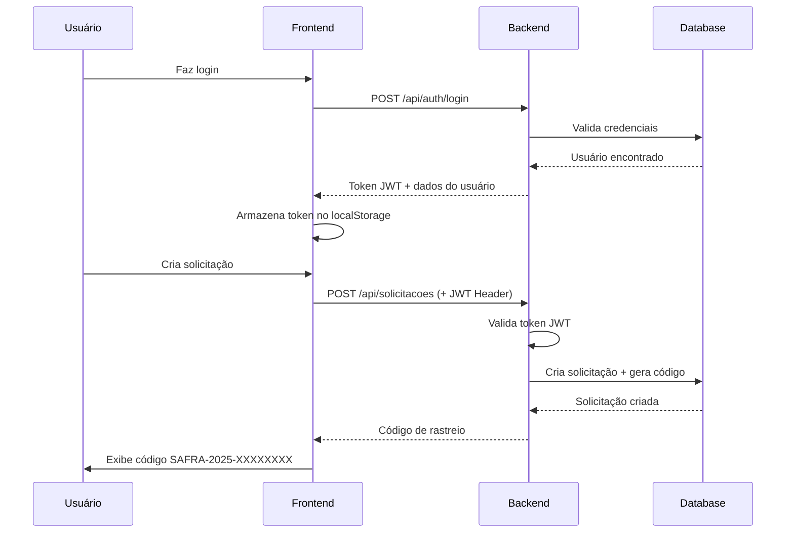

# 🌱 S.A.F.R.A. - Sistema Automatizado de Fornecimento e Rastreamento Agrícola

<div align="center">


**Sistema web integrado para gestão e rastreamento de distribuição de insumos agrícolas**

[🚀 Começar](#-instalação) • [📖 Documentação](#-documentação) • [🤝 Contribuir](#-como-contribuir)

</div>

---

## 📋 Sobre o Projeto

O **S.A.F.R.A.** é uma plataforma desenvolvida para modernizar e otimizar o processo de solicitação, distribuição e rastreamento de insumos agrícolas (sementes, mudas, fertilizantes) fornecidos pelo **Instituto Agronômico de Pernambuco (IPA)**.

### 🎯 Objetivos

- ✅ Digitalizar o processo de solicitação de insumos
- 🔍 Fornecer rastreamento em tempo real das solicitações
- 📊 Centralizar informações de beneficiários e solicitantes
- 🚀 Aumentar a eficiência e transparência na distribuição
- 📱 Facilitar o acesso através de interface web moderna

### 👥 Público-Alvo

- **Técnicos do IPA**: Solicitação de insumos para agricultores assistidos
- **Agricultores**: Beneficiários finais dos insumos
- **Gestores**: Acompanhamento e análise de distribuições

---

## 🏗️ Arquitetura do Sistema

```
┌─────────────────────────────────────────────────────────────┐
│                      Frontend (React)                       │
│  ┌────────────┐  ┌────────────┐  ┌─────────────────────┐    │
│  │ TypeScript │  │  Tailwind  │  │  shadcn/ui + Radix  │    │
│  │  + Vite    │  │  CSS       │  │  UI Components      │    │
│  └────────────┘  └────────────┘  └─────────────────────┘    │
└─────────────────────────────────────────────────────────────┘
                         ↕ REST API
┌─────────────────────────────────────────────────────────────┐
│                    Backend (Spring Boot)                    │
│  ┌─────────────┐  ┌──────────────┐  ┌─────────────────┐     │
│  │ Spring Boot │  │ Spring       │  │ JWT Auth +      │     │
│  │ 3.5.8       │  │ Security     │  │ BCrypt          │     │
│  └─────────────┘  └──────────────┘  └─────────────────┘     │
└─────────────────────────────────────────────────────────────┘
                       ↕ JPA/Hibernate
┌─────────────────────────────────────────────────────────────┐
│                     Database (MySQL)                        │
│  • Usuários IPA    • Beneficiários    • Solicitações        │
│  • Sementes        • Rastreamento     • Histórico           │
└─────────────────────────────────────────────────────────────┘
```

---

## 🛠️ Tecnologias Utilizadas

### Frontend
- **Framework**: React 18 + TypeScript
- **Build Tool**: Vite
- **Estilização**: Tailwind CSS
- **Componentes UI**: shadcn/ui (Radix UI)
- **Roteamento**: React Router DOM
- **Gerenciamento de Estado**: React Context API
- **Requisições HTTP**: Axios
- **Formulários**: React Hook Form + Zod
- **Notificações**: Sonner
- **Ícones**: Lucide React
- **Datas**: date-fns

### Backend
- **Framework**: Spring Boot 3.5.8
- **Linguagem**: Java 17
- **Segurança**: Spring Security + JWT (JSON Web Tokens)
- **Criptografia**: BCrypt
- **ORM**: Hibernate (JPA)
- **Documentação API**: SpringDoc OpenAPI (Swagger)
- **Validação**: Bean Validation
- **Banco de Dados**: MySQL 8.0

### DevOps & Ferramentas
- **Controle de Versão**: Git + GitHub
- **Package Manager**: npm (Frontend) + Maven (Backend)
- **IDE Recomendada**: VSCode (Frontend) + IntelliJ IDEA (Backend)

---

## 📦 Instalação

### Pré-requisitos

- **Node.js** 18+ e npm
- **Java JDK** 17+
- **MySQL** 8.0+
- **Git**

### 1️⃣ Clone o Repositório

```bash
git clone https://github.com/VitorrSantoss/PI-IPA.git
cd PI-IPA
```

### 2️⃣ Configuração do Banco de Dados

```sql
-- Crie o banco de dados
CREATE DATABASE ipa_db CHARACTER SET utf8mb4 COLLATE utf8mb4_unicode_ci;

-- Configure o usuário (opcional)
CREATE USER 'ipa_user'@'localhost' IDENTIFIED BY 'sua_senha';
GRANT ALL PRIVILEGES ON ipa_db.* TO 'ipa_user'@'localhost';
FLUSH PRIVILEGES;
```

### 3️⃣ Configuração do Backend

```bash
cd "IPA - Back"

# Edite o arquivo application.properties
nano src/main/resources/application.properties
```

```properties
# MySQL Database Configuration
spring.datasource.url=jdbc:mysql://localhost:3306/ipa_db?allowPublicKeyRetrieval=true&useSSL=false&serverTimezone=UTC
spring.datasource.username=root
spring.datasource.password=sua_senha

# JWT Configuration
jwt.secret=sua-chave-secreta-muito-segura-com-pelo-menos-256-bits
jwt.expiration=86400000

# JPA/Hibernate
spring.jpa.hibernate.ddl-auto=update
spring.jpa.show-sql=true
```

```bash
# Instale as dependências e inicie o backend
./mvnw clean install
./mvnw spring-boot:run
```

**Backend rodando em**: `http://localhost:8080`

### 4️⃣ Configuração do Frontend

```bash
cd ../IPA-Front

# Instale as dependências
npm install

# Configure as variáveis de ambiente
echo "VITE_API_URL=http://localhost:8080/api" > .env

# Inicie o servidor de desenvolvimento
npm run dev
```

**Frontend rodando em**: `http://localhost:5173`

---

## 🚀 Como Usar

### 1. **Cadastro de Usuário**
- Acesse `/cadastro`
- Preencha os dados do técnico do IPA
- Aguarde aprovação (em produção)

### 2. **Login**
- Acesse `/login`
- Use seu CPF e senha

### 3. **Nova Solicitação**
- Clique em "Solicitar Insumos"
- Preencha 3 etapas:
  1. **Dados do Agricultor Beneficiado**
  2. **Detalhes do Insumo** (tipo, cultura, quantidade)
  3. **Logística e Entrega**
- Revise e confirme

### 4. **Rastreamento**
- Acesse "Minhas Solicitações" no menu do usuário
- Ou use a página de rastreamento com o código gerado
- Formato: `SAFRA-2025-XXXXXXXX`

---

## 📁 Estrutura do Projeto

```
PI-IPA/
├── IPA-Front/                    # Frontend React
│   ├── src/
│   │   ├── components/           # Componentes reutilizáveis
│   │   │   ├── ui/              # Componentes shadcn/ui
│   │   │   ├── Header.tsx
│   │   │   ├── Footer.tsx
│   │   │   └── ProtectedRoute.tsx
│   │   ├── contexts/            # Context API
│   │   │   └── AuthContext.tsx
│   │   ├── pages/               # Páginas da aplicação
│   │   │   ├── Index.tsx
│   │   │   ├── Login.tsx
│   │   │   ├── Registro.tsx
│   │   │   ├── MinhasSolicitacoes.tsx
│   │   │   ├── Rastreamento.tsx
│   │   │   └── solicitar/       # Fluxo de solicitação
│   │   │       ├── DadosAgricultor.tsx
│   │   │       ├── DetalhesInsumo.tsx
│   │   │       ├── Logistica.tsx
│   │   │       └── Resumo.tsx
│   │   ├── services/            # Serviços API
│   │   │   ├── api.ts
│   │   │   ├── authService.ts
│   │   │   └── solicitacaoservice.ts
│   │   └── App.tsx              # Rotas principais
│   └── package.json
│
└── IPA - Back/                   # Backend Spring Boot
    ├── src/main/java/com/ipa/backend/
    │   ├── config/              # Configurações
    │   │   ├── SecurityConfig.java
    │   │   ├── CorsConfig.java
    │   │   ├── JwtUtil.java
    │   │   └── JwtAuthenticationFilter.java
    │   ├── controller/          # Endpoints REST
    │   │   ├── AuthController.java
    │   │   ├── SolicitacaoController.java
    │   │   └── UsuarioController.java
    │   ├── dto/                 # Data Transfer Objects
    │   │   ├── LoginDTO.java
    │   │   ├── LoginResponseDTO.java
    │   │   ├── SolicitacaoDto.java
    │   │   └── UsuarioIpaDTO.java
    │   ├── model/               # Entidades JPA
    │   │   ├── Usuario.java
    │   │   ├── UsuarioIpa.java
    │   │   └── Solicitacao.java
    │   ├── repository/          # Repositórios JPA
    │   │   ├── UsuarioRepository.java
    │   │   ├── UsuarioIpaRepository.java
    │   │   └── SolicitacaoRepository.java
    │   └── service/             # Lógica de negócio
    │       ├── AuthService.java
    │       ├── SolicitacaoService.java
    │       └── CustomUserDetailsService.java
    ├── src/main/resources/
    │   └── application.properties
    └── pom.xml
```

---

## 🔑 Endpoints da API

### Autenticação

| Método | Endpoint | Descrição | Auth |
|--------|----------|-----------|------|
| POST | `/api/auth/register` | Cadastrar novo usuário | ❌ |
| POST | `/api/auth/login` | Fazer login | ❌ |
| GET | `/api/auth/test` | Testar API | ❌ |

### Solicitações

| Método | Endpoint | Descrição | Auth |
|--------|----------|-----------|------|
| GET | `/api/solicitacoes` | Listar todas | ✅ |
| GET | `/api/solicitacoes/{id}` | Buscar por ID | ✅ |
| GET | `/api/solicitacoes/rastrear/{codigo}` | Rastrear por código | ✅ |
| GET | `/api/solicitacoes/solicitante/{cpf}` | Listar por solicitante | ✅ |
| GET | `/api/solicitacoes/status/{status}` | Filtrar por status | ✅ |
| POST | `/api/solicitacoes` | Criar solicitação | ✅ |
| PUT | `/api/solicitacoes/{id}` | Atualizar | ✅ |
| PATCH | `/api/solicitacoes/{id}/status` | Atualizar status | ✅ |
| DELETE | `/api/solicitacoes/{id}` | Deletar | ✅ |

**Documentação completa**: `http://localhost:8080/swagger-ui.html`

---

## 🔒 Segurança

### Autenticação JWT
- Tokens gerados com algoritmo HS256
- Expiração configurável (padrão: 24h)
- Refresh automático no frontend

### Proteção de Rotas
- Backend: Spring Security com filtros JWT
- Frontend: ProtectedRoute component

### Criptografia
- Senhas: BCrypt (custo 10)
- Tokens: HMAC-SHA256

### CORS
- Configurado para desenvolvimento local
- Ajustar para produção

---

## 📊 Fluxo de Dados



---

## 🧪 Testes

### Backend
```bash
cd "IPA - Back"
./mvnw test
```

### Frontend
```bash
cd IPA-Front
npm run test
```

---

## 🚧 Roadmap

- [x] Sistema de autenticação JWT
- [x] CRUD de solicitações
- [x] Rastreamento por código
- [x] Interface responsiva
- [ ] Dashboard administrativo
- [ ] Notificações por email
- [ ] Exportação de relatórios (PDF/Excel)
- [ ] Sistema de aprovação em múltiplos níveis
- [ ] App mobile (React Native)
- [ ] Integração com estoque

---

## 🤝 Como Contribuir

1. Faça um Fork do projeto
2. Crie uma branch para sua feature (`git checkout -b feature/MinhaFeature`)
3. Commit suas mudanças (`git commit -m 'Adiciona MinhaFeature'`)
4. Push para a branch (`git push origin feature/MinhaFeature`)
5. Abra um Pull Request

### Padrões de Código

**Frontend**:
- ESLint + Prettier
- Componentes funcionais com hooks
- TypeScript strict mode

**Backend**:
- Checkstyle
- Convenções Java padrão
- Javadoc em métodos públicos

---

## 📝 Licença

Este projeto está sob a licença MIT. Veja o arquivo [LICENSE](LICENSE) para mais detalhes.

---

## 👨‍💻 Autores

- **Lucas Vinicius** - *Desenvolvimento Fullstack* [@Lucasvrr-Dev](https://github.com/Lucasvrr-Dev)
- **Vitor Santos** - *Desenvolvimento Back-End*
- **Vitória Barboza** - *Desenvolvimento Front-End*
- **Renan Souza** - *Desenvolvimento Front-End*
- **Luis Miguel** - *Desenvolvimento Front-End*

---

## 🙏 Agradecimentos

- **Instituto Agronômico de Pernambuco (IPA)**
- Comunidade open source pelas ferramentas utilizadas

---

<div align="center">

**Desenvolvido com 💚 para o agronegócio brasileiro**

</div>
